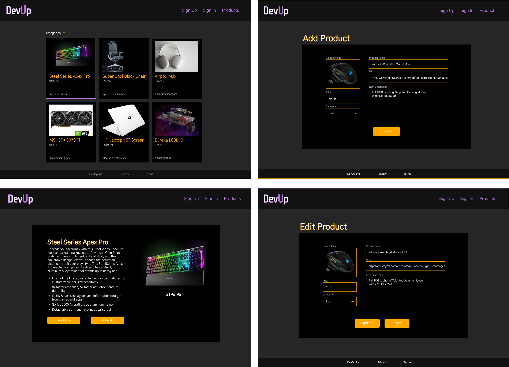
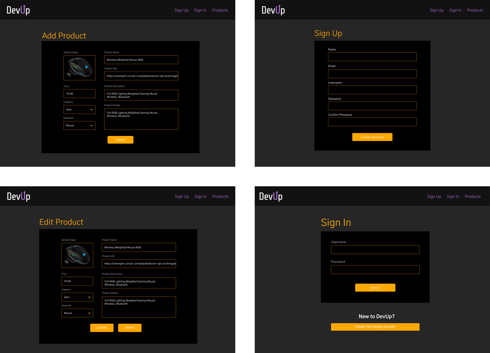
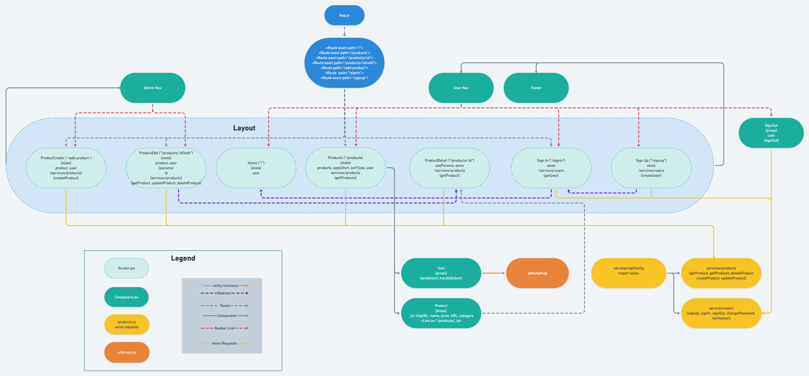

# devup


## Project Description


## Wireframes
The following wireframes depict desktop screen layouts for the app.





## Component Hierarchy



## API and Data Sample


MongoDB is returning the data for this base as follows:

```


```

### MVP

#### MVP

- 

## Project Schedule

|  Day | Deliverable | Status
|---|---| ---|
|Oct 7| Wire Frame building and approval | Complete
|Oct 8| Component  hierarchy/ Repo Approval | Incomplete
|Oct 9-10 | Pseudocode / structure components and set up backend  | Incomplete
|Oct 10 | Initial Clickable Model  | incomplete
|Oct 11| functional screens | Incomplete
|Oct 12| syling and cleaning code | Complete
|Oct 13| Styling MVP| Incomplete
|Oct 14| Post MVP | Incomplete
|Oct 15| Post MVP | Incomplete
|Oct 18| Project Presentation | Incomplete

## Timeframes

| Component                 | Priority | Estimated Time | Time Invested | Actual Time |
| ------------------------- | :------: | :------------: | :-----------: | :---------: |
| Proposal                  |    H     |      1hr       |           |         |
| Proposal                  |    H     |      1hr       |           |         |
| Set up Routes/Controllers for Backend|    H     |      1hr       |           |         |
| Seed Data                 |    H     |      2hr       |           |         |
| Set up/test all API calls |    H     |      3hrs      |           |         |
| Create top10 component    |    H     |      3hrs      |           |         |
| Create details component  |    H     |      3hr       |           |         |
| Create submit component   |    H     |      3hrs      |           |         |
| Create vote component     |    H     |      3hrs      |           |         |
| Structure/Basic styling   |    H     |      3hrs      |           |         |
| CSS Components            |    H     |      3hrs      |           |         |
| Create Review Component   |    M     |      5hrs      |           |         |
| Edit/Delete Reviews       |    L     |      5hrs      |           |         |
| Style Review Component    |    M     |      3hrs      |           |         |
| Advanced CSS              |    L     |      3hrs      |           |         |
| Sort reviews and restrict edit/delete|    L  |  3hrs  |           |         |
| Create modals             |    L     |      3hrs      |           |         |
| Total                     |          |to MVP 26hrs    |           |         |

## Code Snippet


```


```


