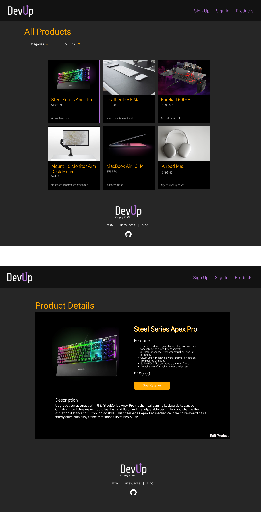

# devup


## Project Description
DevUp is an e-commerce application that allows IT professionals to improve the quality of their work space by providing them with the latest tech gadgets. On the home screen users are given different categories to explore including furniture, accessories, and additional gear. After choosing a category, users get access to its full library of items, where they can compare gadgets based on price and other characteristics. Once a user finds an item that they like,they can get detailed information on it before adding it to their favorites.


## Wireframes
The following wireframes depict desktop screen layouts for the app.




## Component Hierarchy


## API and Data Sample


MongoDB is returning the data for this base as follows:

```


```

### MVP


#### MVP
- Set up and deploy backend to heroku
- Set up and deploy front end to netlify
- Full CRUD on backend and front end
- Authentication
- Responsive styling

## Project Schedule

|  Day | Deliverable | Status
|---|---| ---|
|Oct 7| Wire Frame building and approval | Complete
|Oct 8| Component  hierarchy/ Repo Approval | Incomplete
|Oct 9-10 | Pseudocode / structure components and set up backend  | Incomplete
|Oct 10 | Initial Clickable Model  | incomplete
|Oct 11| functional screens | Incomplete
|Oct 12| syling and cleaning code | Incomplete
|Oct 13| Styling MVP| Incomplete
|Oct 14| Post MVP | Incomplete
|Oct 15| Post MVP | Incomplete
|Oct 18| Project Presentation | Incomplete

## Timeframes

| Component                 | Priority | Estimated Time | Time Invested | Actual Time |
| ------------------------- | :------: | :------------: | :-----------: | :---------: |
| Proposal Approval         |    H     |      1hr       |           |         |
| Create Database           |    H     |      3hr       |           |         |
| Set up Routes/Controllers for Backend|    H   | 3hrs   |           |         |
| Create and Seed Data      |    H     |      2hr       |           |         |
| Set up front end          |    H     |      4hrs      |           |         |
| Set up front end routes   |    H     |      4hrs      |           |         |
| Create/test API calls     |    H     |      3hrs      |           |         |
| Create products component |    H     |      3hr       |           |         |
| Create details component  |    H     |      3hrs      |           |         |
| Create/Edit component     |    H     |      3hrs      |           |         |
| Sign In/Sign Up screen    |    H     |      3hrs      |           |         |
| Basic styling             |    H     |      6hrs      |           |         |
| Categories/sorting        |    M     |      3hrs      |           |         |
| Advanced CSS              |    H     |      6hrs      |           |         |
| Post MVP                  |    L     |  3hrs  |           |         |
| Debug/clean up code       |    H     |      3hrs      |           |         |
| Total                     |          |to MVP 53hrs    |           |         |

## Code Snippet


```


```


